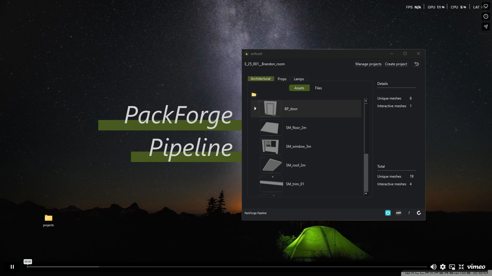

PackForge is a pipeline application primarily intended for creating 3D digital products to sell on marketplaces such as CgTrader or Fab, but also for personal projects or portfolios.

It consists of a desktop application and a Maya shelf.
The desktop application provides an overview of the progression of the project and is where DCC scenes can be opened.
The Maya shelf loads when a Maya scene is opened from the desktop app and is primarly used to export assets so that they can be manually imported into Unreal Engine. It also offers commands for renaming the asset to guarantee that the Unreal naming convention is respected as well as other useful commands.

Its creation proved necessary to reduce production time by automating repetitive tasks, for example like reaching the scene to open navigating throught the folders, thereby guaranteeing artists maximum creative freedom without interruptions or slowdowns.

## Desktop app
* open DCC scenes (Maya, Adobe 3D Painter, Marvelous Designer)
* create DCC scenes (Maya, Adobe 3D Painter, Marvelous Designer)
* display the assets that are ready to be imported to Unreal Engine, to add clarity about the progression of the project

## Maya shelf
* export fbx asset
* take asset screenshot
* increment save scene

